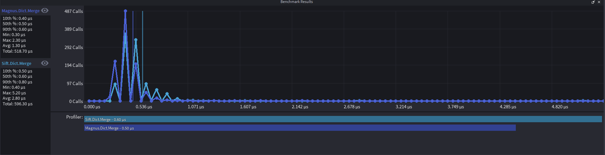
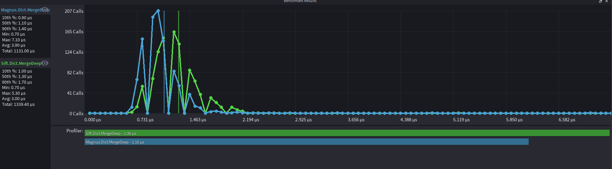

# BENCHMARKS

All benchmarks are in comparision to Sift (found here https://github.com/cxmeel/sift)

## Some

unsuprisingly, same speeds as they do the same thing, Magnus just has better type support

## Merge

about the same speeds as well

## Merge_Deep

almost same speeds

# Conclusion

Most of the functions end up being the same, with Magnus slightly being faster, unless the source is highly different between the two, theres no point in making a test